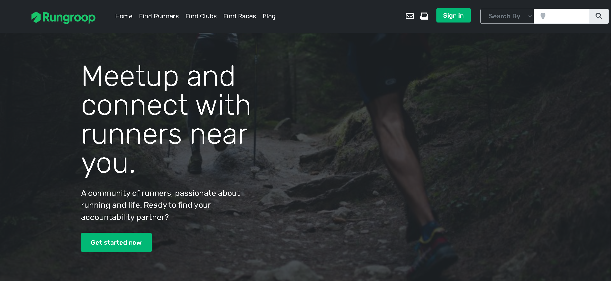

# RunGroop

**Find Running Clubs Near You • Meetup • Accountability • Community**

---

## 🚀 What is RunGroop

RunGroop helps runners connect, motivate each other, and discover local running groups & events. Whether you’re training for a race, trying to stay consistent, or just want company on your jogs, RunGroop makes it easy to:  
- Find nearby running groups  
- Join events or join/create “Places to Run”  
- Get accountability partners  
- Create and manage your own running club/group  

---

## 📱 Features

| Feature | Description |
|---------|-------------|
| **User Registration & Sign-In** | Sign up via Email, Google, or Strava |
| **Groups & Clubs** | Browse existing running clubs, or start your own |
| **Events** | Find & attend local running events |
| **Places To Run** | Discover routes, parks, trails near you |
| **Local Guides** | Tips & info about running in different areas |
| **Search by City / Location** | Explore top running cities or see what’s nearby |

---

## 🛠️ Tech Stack *(Example / Suggested)*

> *(You can adjust this according to your real implementation.)*

- **Frontend**: React, or Angular, HTML5 / CSS3 / Tailwind or Bootstrap  
- **Backend / API**: ASP.NET Core or Node.js or whatever you use  
- **Authentication**: Google OAuth, Strava integration, Email + Password  
- **Database**: SQL Server / MySQL / PostgreSQL  
- **Tools**: Git, GitHub, REST APIs, Postman, etc.  

---

## 📸 Screenshots / Demo

